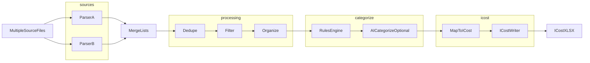

# Python CLI（账单转 ICost）项目基本框架

## 设计原则

- **src 布局**：包名与可执行入口分离；**CLI 只编排流水线**，各阶段可单测：解析 → 合并 → 后处理 → 归类 → 写出 ICost。
- **多文件优先**：一次命令可传入多个路径（或目录/glob，实现阶段再定），先各自解析为统一 **`Transaction` 列表**，再进入共享后处理与归类。
- **配置驱动**：过滤、**分类白名单**、关键字规则、AI 开关等来自 **`config.yml`**；**去重键固定**为「日期截断到天 + 金额」，不在配置中随意改键，避免 silently 改变合并语义。密钥走 **环境变量** 或本地覆盖文件。
- **分类封闭集**：**D/E 列**（一级、二级分类）只能取配置里声明的合法组合；`rules` 与 **AI 归类** 的输出均须 **校验**，非法则记警告并置空或回退策略（实现时二选一并写入 Rules）。
- **扩展点**：每种「源账单格式」一个解析器模块 + registry 注册；**新增格式不改变流水线接口**，只增加 `sources/` 下实现与对应测试/fixture。
- **AI 驱动开发**：**Cursor Rules** 约束架构；**Skills** 固化「新增一类账单」的可重复步骤（解析器 + fixture + 测试 + 注册），便于你逐步投喂新格式时稳定执行。

## 推荐目录树（起点）

```text
iCostPort/
├── pyproject.toml              # 项目元数据、依赖声明、可选的 [tool.*]（ruff/pytest）
├── uv.lock
├── .python-version
├── .gitignore                  # 忽略 .venv/、config.local.yml（若采用）；勿忽略 uv.lock
├── config.example.yml          # categories 白名单、关键字 rules、processing / ai
├── icost_template.xlsx         # ICost 导入模板（权威列定义）；writer 与黄金测试对齐此文件
├── README.md                   # 可选
│
├── src/
│   └── icostport/
│       ├── __init__.py
│       ├── __main__.py
│       ├── cli.py              # Click：多文件参数、--config、子命令 convert；调用 pipeline.run
│       │
│       ├── core/
│       │   ├── __init__.py
│       │   ├── settings.py     # 加载 config.yml + 环境变量覆盖；运行时 Settings 对象
│       │   ├── exceptions.py
│       │   ├── logging_.py     # loguru：控制台/文件 sink、与 CLI verbose 联动
│       │   └── model.py        # Transaction（含 raw 描述、金额、时间、账户、source_path、category…）
│       │
│       ├── pipeline.py         # 或 pipeline/ 包：parse_all → merge → process → categorize → write
│       ├── processing/         # 合并后的「与格式无关」操作
│       │   ├── __init__.py
│       │   ├── merge.py        # 多文件结果合并为单一列表（可打标签溯源）
│       │   ├── dedupe.py       # 固定键：交易日期按天 + 金额；同日同额保留策略可配置（如 keep_first）
│       │   ├── filter.py       # 金额区间、关键字黑白名单、账户过滤等
│       │   └── organize.py     # 排序、分组视图准备等「整理」
│       │
│       ├── categorize/
│       │   ├── __init__.py
│       │   ├── rules.py        # 关键字 DSL：命中描述等字段 → 必须在 categories 白名单内的一级/二级
│       │   └── ai_categorize.py # 可选：对未归类项调用 LLM；可配置 batch、模型、超时
│       │
│       ├── ai/
│       │   ├── __init__.py
│       │   └── client.py       # 统一 HTTP/SDK 调用；只读 Settings 中的 base_url、model、api_key_env
│       │
│       ├── icost/
│       │   ├── __init__.py
│       │   ├── schema.py       # ICostRow：dataclass 等轻量结构，与模板列一一对应（不用 pydantic）
│       │   └── writer.py       # openpyxl 写出 .xlsx：首行表头与模板一致，数据从第 2 行起
│       │
│       └── sources/
│           ├── __init__.py
│           ├── base.py         # parse(path) -> list[Transaction] 或 Document+行级解析
│           ├── registry.py
│           └── example_csv.py
│
├── prompts/                    # 可选：AI 归类用 system/user 模板（代码只读路径）
│   └── categorize.md
│
├── tests/
│   ├── conftest.py
│   ├── test_cli.py
│   ├── test_processing/
│   │   ├── test_dedupe.py
│   │   └── test_filter.py
│   ├── test_categorize/
│   │   └── test_rules.py
│   ├── test_icost/
│   └── fixtures/
│       ├── sample_bank_a.csv
│       └── config_minimal.yml
│
└── .cursor/
    ├── rules/
    │   └── icostport.mdc
    └── skills/
        └── add-bill-format/    # 见下文「Skill：新增账单格式」
            └── SKILL.md
```

说明：

- **`cli.py`**：解析「多输入路径 + config 路径 + 输出路径」；调用 **`pipeline`**（或同名模块）串联阶段，便于集成测试 mock 某一阶段。
- **`core/model.py`**：`Transaction` 含 **`source_path`**、可选 **`fingerprint`**（去重）、**`type`/`amount`/`note`/账户/货币** 等；**归类**建议能落到 **一级分类 / 二级分类**（与模板列一致），映射与格式化在 **`icost/schema.py` + `writer.py`** 完成。
- **`processing/`**：只操作 `list[Transaction]`，单元测试不依赖具体银行格式。
- **`categorize/`**：先 **`rules`**（确定性、可测），再 **`ai_categorize`**（仅对 `category is None` 或 `--ai-categorize` 开启的项，避免全量调用与费用爆炸）。
- **`config.example.yml`**：与 **`settings.py`** 的 pydantic 模型一一对应；真实密钥用 **`${ENV_VAR}`** 引用或单独 `config.local.yml`（gitignore）。
- **`tests/fixtures/config_minimal.yml`**：测试用最小配置，避免测试依赖本机 `~/.config`。

若你更偏好 **扁平包**（根目录直接 `icostport/` 而非 `src/icostport`），也可以，但 `pyproject.toml` 里要把包发现指对（uv 与 hatchling/setuptools 均可，见下节）；**src 布局**仍是当前社区与打包工具默认推荐。

## 入口方式（与 `cli.py` 的配合）

在 `pyproject.toml` 中声明 console script，例如：

- 命令名：`icostport` → 指向 `icostport.cli:main`（Click 的 `cli()` 入口）

同时保留：

- `python -m icostport` → `[src/icostport/__main__.py](src/icostport/__main__.py)` 里调用与 `cli.py` 相同的入口函数。

## AI 相关：放什么、不放什么


| 位置                                                   | 用途                                                                   |
| ---------------------------------------------------- | -------------------------------------------------------------------- |
| `[.cursor/rules/*.mdc](.cursor/rules/icostport.mdc)` | **必做**：写清包结构、命名、异常类型、测试必须带 fixture、新增格式必须注册到 `registry` 等。           |
| `[.cursor/skills/add-bill-format/](.cursor/skills/)`      | **推荐**：你每新增一类账单时，按 Skill 逐步添加 `sources/` 解析器、`tests/fixtures`、单测、`registry` 注册。 |
| 仓库根 `AGENTS.md`（可选）                                  | 给其他 Agent/CI 的一句话导航：如 `uv sync`、`uv run pytest`、CLI 入口、目录说明。                |
| **不要把** 大段提示词塞进业务代码                                  | 提示词若用于「AI 解析非结构化账单」，可单独 `prompts/` 或 `ai/` 下的 `.txt`/`.md`，代码只读文件路径。 |


**归类用 LLM** 与「用 LLM 解析扫描件/PDF」可分离：前者落在 `categorize/ai_categorize.py` + `prompts/`；若日后要对非结构化原文做 OCR/LLM 解析，再在对应 `sources/` 内调用 `ai/client`，避免全项目耦合。

## 统一配置：`config.yml`

建议单文件分区（名称可按实现微调），**示例结构**：

- **`categories`（必做）**：**封闭taxonomy**。推荐 YAML 结构为「一级 → 其下允许的二级列表」，例如 `餐饮: [三餐, 夜宵]`；加载时构建 **合法 (一级, 二级) 集合**，供 `rules` / AI 结果校验与 prompt 约束共用。
- **`processing`**：`dedupe`（**键固定**：交易**日历日**（由账单时间截断到天，时区/本地化在实现中固定）+ **金额数值**（与解析器一致，建议统一小数位数再比较）；可配 `enabled`、`on_duplicate`：`keep_first` / `keep_last` 等）、`filter`、`sort`。
- **`rules`**：有序列表；**DSL 仅为关键字**：每项含 `keywords`（字符串列表，匹配备注/商户等约定字段时 **子串包含** 即命中，大小写策略在实现中固定并文档化）、**`primary` / `secondary`**（必须是 `categories` 中已定义的一对）；**先匹配先生效**。
- **`ai`**：`enabled`、`provider`、`base_url`、`model`、`api_key_env`、`only_if_uncategorized`、`max_items`、`timeout`；**prompt 必须附带合法分类表**；响应解析后 **同一套校验**，不通过则丢弃 AI 结果。
- **全局**：默认输出路径、日志级别、统计等。

**加载顺序建议**：CLI `--config` → 环境变量 `ICOSTPORT_CONFIG` → 当前目录 `config.yml` → 用户目录（可选）；**敏感信息**只用 env 或 `config.local.yml`（gitignore）。

## 数据流（多文件 + 后处理 + 归类）



**归类顺序**：`rules` 先执行；对仍未归类项，若 `config.ai.enabled` 则走 `aiCat`（可配置仅对未归类调用）。

## Skill：新增账单格式（固定操作）

在 `.cursor/skills/add-bill-format/SKILL.md` 中写清步骤，例如：

1. 在 `tests/fixtures/` 增加脱敏样例（最小可复现）。
2. 在 `src/icostport/sources/` 新增 `xxx.py`，实现 `parse(path) -> list[Transaction]`，并在 `registry.py` 注册扩展名或 magic。
3. 添加 `tests/test_sources/test_xxx.py`，覆盖解析行数、金额符号、异常 CSV。
4. 跑 `uv run pytest`；必要时在 `config.example.yml` 增加该格式相关示例 rules。

Rules 里引用该 Skill：「用户说新增某银行/某导出格式时，优先按 `add-bill-format` Skill 执行」。


## 依赖与环境：**uv**

- **初始化**：在仓库根执行 `uv init`（可加 `--package` / `--lib` 等按 uv 版本文档选用）；指定 `requires-python`，并用 `uv python pin 3.12`（或你选的版本）生成 `.python-version`。
- **安装依赖**：`uv add click loguru pyyaml pydantic openpyxl httpx`；`uv add --dev pytest`（可选 `--dev ruff` 用于格式化与 lint）。
- **同步环境**：`uv sync`（根据 `pyproject.toml` + `uv.lock` 创建/更新 `.venv`）。
- **日常命令**：`uv run icostport ...` 或 `uv run python -m icostport`；测试 `uv run pytest`；格式化/检查 `uv run ruff format .` / `uv run ruff check .`（也可用 `uvx ruff` 作为一次性工具，但项目内更推荐锁进 dev 依赖以便 CI 一致）。
- **打包后端**：uv 兼容标准 `pyproject.toml`；常用 **`hatchling`** 作为 `build-system`（`uv init` 常见默认）或 `setuptools`。console script 仍在 `[project.scripts]` 声明，与 pip/uv 安装一致。
- **CI 建议**：在流水线里 `curl`/`action` 安装 uv 后执行 `uv sync --frozen` + `uv run pytest`，避免环境漂移。

## 工具链建议（依赖选型，由 `uv add` 写入 `pyproject.toml`）

- **CLI**：**Click**。
- **日志**：**loguru**（`core/logging_.py` 中集中配置；业务与流水线用 `logger` 即可）。
- **配置**：**PyYAML + pydantic**。先读取 YAML，再映射到 `Settings` 模型；用字段类型与校验器保证 `categories`、`rules`、`ai` 配置合法。
- **ICost 写出**：**openpyxl**（与 `icost_template.xlsx` 列顺序、表头字面量一致）。
- **HTTP（AI）**：**httpx**（在 `ai/client.py` 集中超时、重试与错误日志）。
- **测试**：**pytest**。
- **可选开发工具**：ruff（format/lint）；类型检查 mypy/pyright 按需，非必选。

## 实施顺序建议

1. `uv init` + `pyproject.toml` + `uv sync`；`cli.py` 支持多输入路径、`--config`、`convert` 子命令。
2. `config.example.yml` + `core/settings.py`（PyYAML 读取 + pydantic 校验 + env 覆盖）；`core/model.py`（`Transaction`）与 `core/exceptions.py`。
3. `pipeline.py` 串联：对每个文件 `registry` 选解析器 → `merge` → `processing`（**dedupe：日+金额**；filter/organize 可先最小实现）。
4. `categorize/rules.py`：加载 **`categories` 白名单** + **关键字 rules**；`ai_categorize.py` 带taxonomy prompt 与输出校验；`ai/client.py` 可关闭占位。
5. `icost/schema.py` + `writer.py`：以仓库根 [`icost_template.xlsx`](/home/xu/project/iCostPort/icost_template.xlsx) 为规范写出 `.xlsx`；`sources/example_csv` 打通端到端。
6. 测试：`test_processing`、`test_categorize`、`test_cli`（多文件 + 最小 config fixture）。
7. `.cursor/rules/icostport.mdc` + `.cursor/skills/add-bill-format/SKILL.md`。

## ICost 输出：与 `icost_template.xlsx` 对齐

**权威参考**：[icost_template.xlsx](/home/xu/project/iCostPort/icost_template.xlsx)（单工作表，当前数据区 `A1:J4`，表头占第 1 行）。

| 列序 | 表头（与模板一致） | 说明（据样例行） |
| --- | --- | --- |
| A | 日期 | 如 `2011年01月11日 12:00:00`；实现阶段需统一 `Transaction` 的 datetime → 该字符串格式 |
| B | 类型 | 样例含：`支出`、`收入`、`转账` |
| C | 金额 | 数值 |
| D | 一级分类 | 仅允许 **`config.categories` 中已定义的一级** |
| E | 二级分类 | 须为该一级下**已列出的二级**；与 D 组成合法对 |
| F | 账户1 | |
| G | 账户2 | 部分行可空 |
| H | 备注 | |
| I | 货币 | 如 `USD`、`CNY` |
| J | 标签 | 如 `#标签1` |

**实现要点**：`ICostWriter` 写出 **`.xlsx`**，**第 1 行表头字符串与上表完全一致**；`openpyxl` 写入数据从第 2 行起。黄金测试可对表头行与样例行做断言，或与模板副本 diff（列名与顺序）。

**归类**：`categorize/rules` 与 AI 仅输出 **白名单内** 的 **D、E**；解析器负责 A、C、F、G、H、I 等来源字段。

## 仍可在实现中细化的点

**关键字匹配字段**（仅备注、或备注+某解析器扩展字段）、**大小写/全半角是否归一**、**日期与金额在单元格中的类型**（字符串 vs Excel 日期序列）可在对接真实银行导出时再定。**去重键（按天+金额）与关键字 DSL** 已按你的要求固定；**列集合与表头字面量以 `icost_template.xlsx` 为准**。